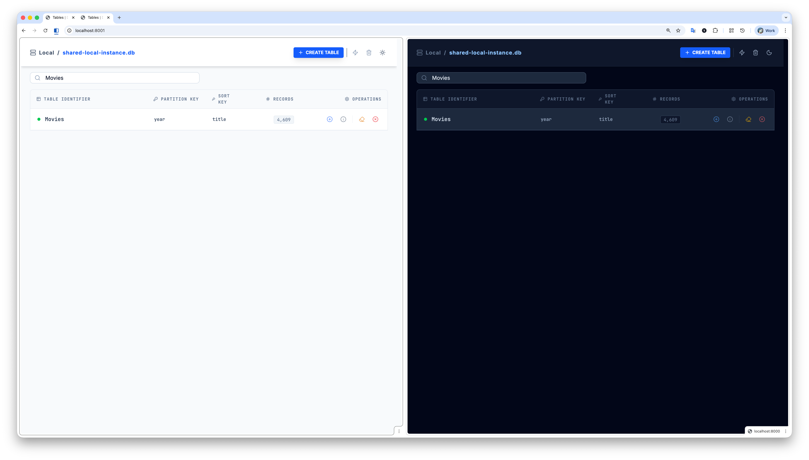
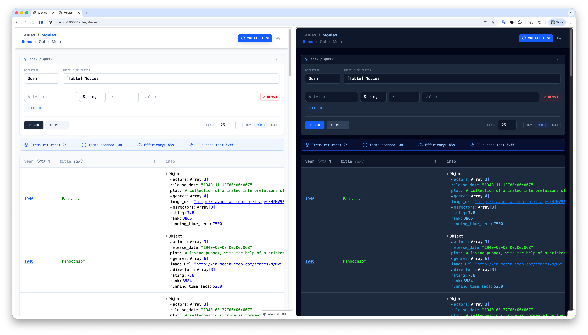
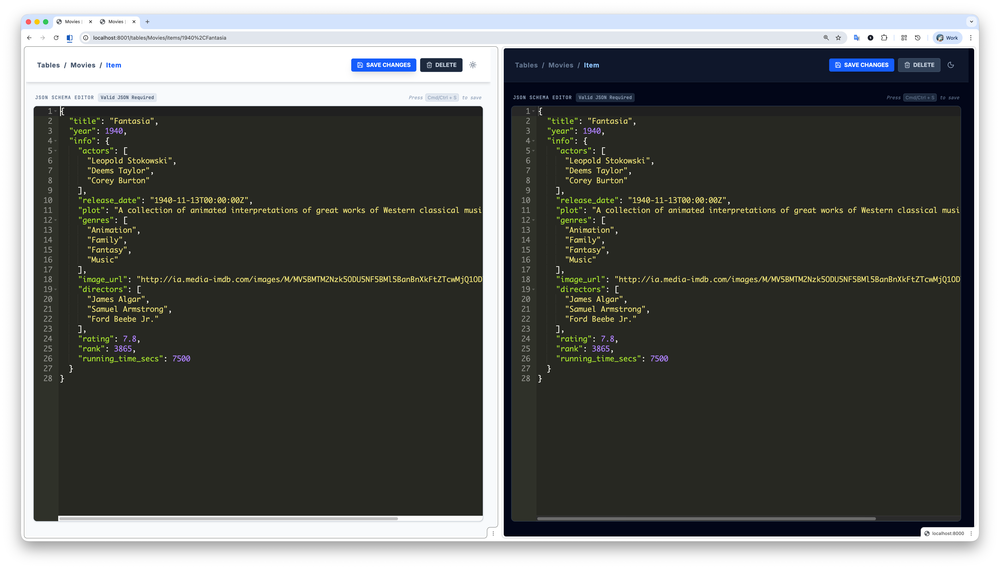
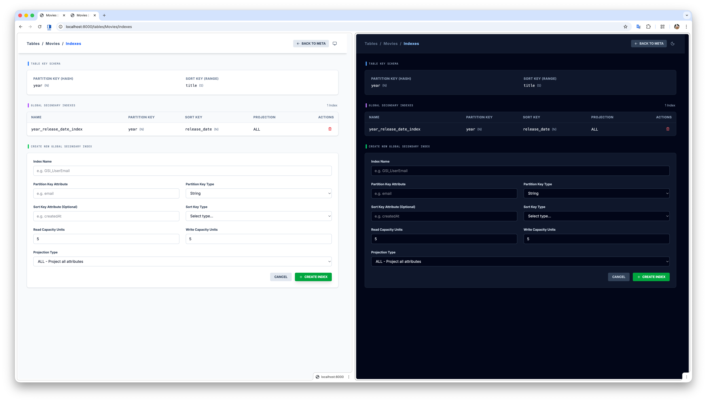
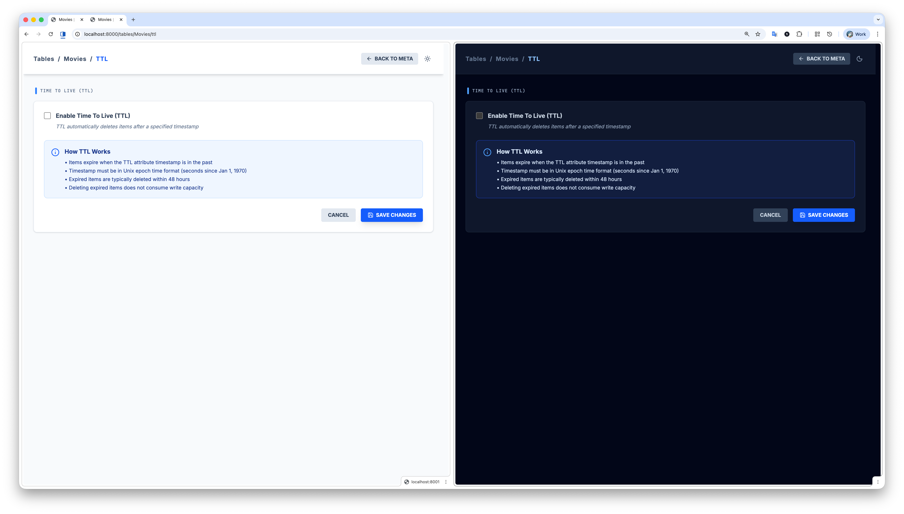
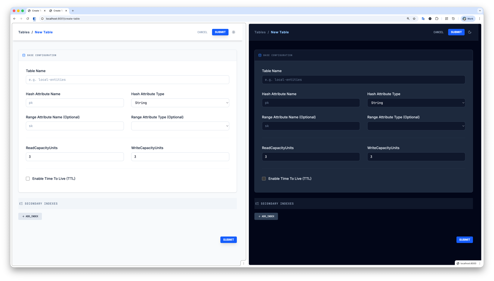

<div align="center">

# DynamoDB Admin

**Modern GUI for DynamoDB Local Development**

[](https://www.npmjs.com/package/dynamodb-admin)
[](LICENSE)
[](package.json)

A powerful web-based GUI for managing [DynamoDB Local](https://aws.amazon.com/blogs/aws/dynamodb-local-for-desktop-development/), [dynalite](https://github.com/mhart/dynalite), and [localstack](https://github.com/localstack/localstack) during development.

[Features](#features) • [Installation](#installation) • [Usage](#usage) • [Screenshots](#screenshots) • [Development](#development)

</div>

---

## Fork Information

> **This is an enhanced fork of [aaronshaf/dynamodb-admin](https://github.com/aaronshaf/dynamodb-admin)**  
> Forked from commit: [`ff648bc`](https://github.com/aaronshaf/dynamodb-admin/commit/ff648bc200dd4e03e10328cdf1a322019e536263)

### What's New in This Fork

This fork brings significant UI/UX improvements and new features to make DynamoDB Local development more productive:

#### Modern UI Overhaul
- **Dark Mode Support** - System-aware theme with manual light/dark/system toggle
- **Tailwind CSS v4** - Complete migration from Bootstrap to modern utility-first CSS
- **Responsive Design** - Optimized for all screen sizes
- **Improved Typography** - Inter font for UI, JetBrains Mono for code/data
- **Lucide Icons** - Modern, consistent iconography throughout

#### New Features
- **TTL Management** - Full Time-To-Live configuration interface
  - Enable/disable TTL with visual status indicators
  - Configure TTL attribute names with validation
  - Visual TTL attribute indicators in item tables

- **Index Management** - Complete GSI/LSI management interface
  - View all Global Secondary Indexes in a clean table layout
  - Create new GSIs with full configuration (projection types, capacity, attributes)
  - Delete indexes with confirmation dialogs
  - Support for INCLUDE projection with non-key attributes

- **Scan Statistics** - Real-time query performance metrics
  - Items returned vs items scanned
  - Query efficiency percentage
  - Read Capacity Units (RCU) consumed
  - Color-coded stats display

- **Enhanced Table Creation** - Extended table creation with:
  - TTL configuration during table creation
  - Better validation and error handling
  - Improved form UX with collapsible sections

#### UX Improvements
- **Collapsible Filter Panel** - Auto-expands when query parameters present
- **Key Type Indicators** - Visual (PK), (SK), (TTL) labels on table columns
- **Unified Error Handling** - Consistent error display across all pages
- **Confirmation Modals** - Reusable modals for destructive actions
- **Date Tooltips** - Hover timestamps to see formatted dates
- **Action Dropdowns** - Grouped actions in clean dropdown menus
- **Sticky Headers** - Table headers stay visible while scrolling

#### Technical Improvements
- **TypeScript** - Full TypeScript support with proper type definitions
- **AWS SDK v3** - Updated to latest AWS SDK architecture
- **Modern Build Pipeline** - Rollup + TypeScript compilation
- **Docker Support** - Multi-stage Docker build with Caddy reverse proxy
- **Better Error Messages** - Standardized JSON error responses
- **Code Quality** - ESLint configuration and consistent code style

---

## Features

- ✅ **Browse Tables** - View all DynamoDB tables with item counts and sizes
- 🔍 **Query & Scan** - Powerful filtering with support for all DynamoDB operators
- 📝 **CRUD Operations** - Create, read, update, and delete items with JSON editor
- 🔑 **Index Management** - Create and manage Global Secondary Indexes
- ⏰ **TTL Configuration** - Enable and configure Time-To-Live settings
- 🎨 **Dark Mode** - Beautiful dark theme with system preference detection
- 📊 **Query Stats** - See scan efficiency and RCU consumption
- 🔒 **Safe Operations** - Confirmation dialogs for destructive actions
- 🐳 **Docker Ready** - Single container with DynamoDB Local + Admin UI

---

## Installation

### Global Installation

```bash
npm install -g dynamodb-admin
```

### Run with npx (No Installation)

```bash
npx dynamodb-admin
```

---

## Usage

### Quick Start

```bash
# Connect to DynamoDB Local on default port (8000)
dynamodb-admin

# Specify custom DynamoDB endpoint
dynamodb-admin --dynamo-endpoint=http://localhost:8000

# Open browser automatically
dynamodb-admin --open

# Custom port and host
dynamodb-admin --port 3000 --host 0.0.0.0
```

### Command Line Options

| Option | Alias | Default | Description |
|--------|-------|---------|-------------|
| `--dynamo-endpoint` | - | `http://localhost:8000` | DynamoDB endpoint URL |
| `--port` | `-p` | `8001` | Server port |
| `--host` | `-h` | `localhost` | Server host |
| `--open` | `-o` | `false` | Open browser on start |
| `--skip-default-credentials` | - | `false` | Skip default credentials setup |

### Environment Variables

You can also configure using environment variables:

```bash
export DYNAMO_ENDPOINT=http://localhost:8000
export PORT=8001
export HOST=localhost
export AWS_REGION=us-east-1
export AWS_ACCESS_KEY_ID=local
export AWS_SECRET_ACCESS_KEY=local

dynamodb-admin
```

### Using with DynamoDB Local (Docker)

```bash
# Start DynamoDB Local
docker run -p 8000:8000 amazon/dynamodb-local

# Start DynamoDB Admin (in another terminal)
dynamodb-admin
```

### All-in-One Docker Setup

**Option 1: Use Pre-built Image from Docker Hub**

```bash
docker run -p 8000:8000 -v dynamodb-data:/app/data/dynamodb hoangdv/dynamodb-local-admin
```

**Option 2: Build from Source**

```bash
docker build -t dynamodb-admin .
docker run -p 8000:8000 -v dynamodb-data:/app/data/dynamodb dynamodb-admin
```

Then open http://localhost:8000 in your browser.

---

## Use as a Library

```javascript
import { DynamoDBClient } from '@aws-sdk/client-dynamodb';
import { createServer } from 'dynamodb-admin';

const dynamoDbClient = new DynamoDBClient({
  region: 'us-east-1',
  endpoint: 'http://localhost:8000',
  credentials: {
    accessKeyId: 'local',
    secretAccessKey: 'local'
  }
});

const app = createServer({ dynamoDbClient });

const server = app.listen(8001, 'localhost');
server.on('listening', () => {
  const address = server.address();
  console.log(`DynamoDB Admin running on http://${address.address}:${address.port}`);
});
```

---

## Screenshots

### Tables Overview

*Browse all tables with real-time stats and dark mode support*

### Items Browser with Scan Statistics

*Query and scan items with real-time performance metrics*

### Item Editor

*Full-featured JSON editor with syntax highlighting*

### Index Management

*Create and manage Global Secondary Indexes*

### TTL Configuration

*Easy Time-To-Live configuration with visual status*

### Create Table

*Enhanced table creation with TTL and index configuration*

---

## Development

### Prerequisites

- Node.js 18+
- DynamoDB Local running on port 8000

### Setup

```bash
# Clone the repository
git clone https://github.com/yourusername/dynamodb-local-admin.git
cd dynamodb-local-admin

# Install dependencies
npm install

# Build the project
npm run build

# Start the development server
DYNAMO_ENDPOINT=http://localhost:8000 npm start
```

### Development Workflow

```bash
# Terminal 1: Watch and rebuild on changes
npm run build:watch

# Terminal 2: Start server with auto-reload
npm start
```

### Build Commands

| Command | Description |
|---------|-------------|
| `npm run build` | Build CSS + TypeScript |
| `npm run build:css` | Build Tailwind CSS only |
| `npm run build:js` | Compile TypeScript only |
| `npm run build:watch` | Watch mode for CSS + JS |
| `npm start` | Start server with nodemon |
| `npm run dev` | Build + start (all-in-one) |
| `npm test` | Run tests |
| `npm run lint` | Run ESLint |
| `npm run fix` | Fix linting issues |

---

## Docker

### Using Pre-built Image

Pull and run the image from Docker Hub:

```bash
docker pull hoangdv/dynamodb-local-admin
docker run -p 8000:8000 -v dynamodb-data:/app/data/dynamodb hoangdv/dynamodb-local-admin
```

Or run directly:

```bash
docker run -p 8000:8000 -v dynamodb-data:/app/data/dynamodb hoangdv/dynamodb-local-admin
```

Access the admin UI at http://localhost:8000

### Build from Source

```bash
docker build -t dynamodb-admin .
docker run -p 8000:8000 -v dynamodb-data:/app/data/dynamodb dynamodb-admin
```

The Docker image uses multi-stage builds for optimization and includes:
- DynamoDB Local (port 8002 internally)
- DynamoDB Admin UI (port 8001 internally)  
- Caddy reverse proxy (port 8000 externally)

---

## Configuration

### Default Credentials

By default, dynamodb-admin sets:
- `AWS_ACCESS_KEY_ID`: "key"
- `AWS_SECRET_ACCESS_KEY`: "secret"
- `AWS_REGION`: "us-east-1"

To skip default credentials and use AWS SDK's default credential provider:

```bash
dynamodb-admin --skip-default-credentials
```

### Credentials for Applications

If your application accesses the same DynamoDB Local instance, ensure both use the same `AWS_ACCESS_KEY_ID`:

```bash
# Terminal 1: DynamoDB Admin
AWS_ACCESS_KEY_ID=mykey AWS_SECRET_ACCESS_KEY=mysecret dynamodb-admin

# Terminal 2: Your App
AWS_ACCESS_KEY_ID=mykey AWS_SECRET_ACCESS_KEY=mysecret node app.js
```

---

## License

MIT License - see [LICENSE](LICENSE) file for details

---

## Docker Hub

This project is available on Docker Hub:

**[hoangdv/dynamodb-local-admin](https://hub.docker.com/r/hoangdv/dynamodb-local-admin)**

```bash
docker pull hoangdv/dynamodb-local-admin
docker run -p 8000:8000 -v dynamodb-data:/app/data/dynamodb hoangdv/dynamodb-local-admin
```

---

## Acknowledgments

- Original project by [Aaron Shafovaloff](https://github.com/aaronshaf/dynamodb-admin)
- AWS DynamoDB team for DynamoDB Local
- All contributors to the original project

---

## Related Projects

- [aaronshaf/dynamodb-admin](https://hub.docker.com/r/aaronshaf/dynamodb-admin/) - Official Docker image
- [instructure/dynamo-local-admin-docker](https://github.com/instructure/dynamo-local-admin-docker) - Docker with integrated setup
- [Camin McCluskey's Quick Start Guide](https://medium.com/swlh/a-gui-for-local-dynamodb-dynamodb-admin-b16998323f8e)

---

<div align="center">

**Made with ❤️ for DynamoDB Local developers**

[⬆ Back to Top](#dynamodb-admin)

</div>
